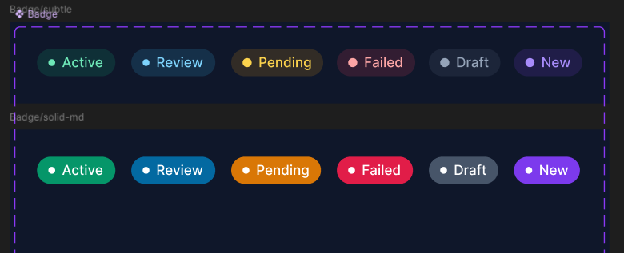
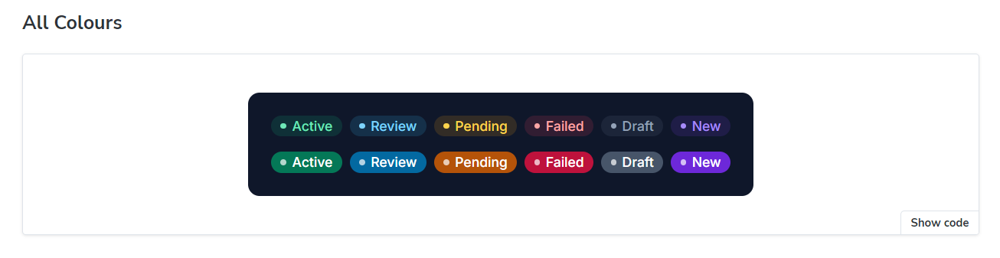

# saas-ui

**Accessible UI primitives for data-heavy SaaS interfaces**  
React · TypeScript · Tailwind CSS

Built to explore how accessible design systems can scale in real SaaS products.

[](https://www.w3.org/WAI/WCAG2AA-Conformance)
[](https://opensource.org/licenses/MIT)
[]()

A focused, opinionated component library built for SaaS product teams. Every component is designed accessibility-first with WCAG AA compliance verified in Storybook, and ships with three built-in themes.

---

## Overview

A component system built for SaaS product teams, focused on accessibility, consistency, and real-world interface patterns.

Most UI libraries cover generic elements but fall short on accessibility and usability in data-heavy interfaces. This project focuses on high-impact components like tables, metrics, and system states — designed and built with accessibility as a first-class constraint.
In practice, this leads to inconsistent implementations, accessibility gaps, and increased complexity in production systems.

Every component is:

- Designed in Figma
- Implemented with pixel precision in code
- Validated against WCAG AA in Storybook

Instead of building a large generic library, this system focuses on a small set of high-impact components commonly used in SaaS dashboards.

---

## Live Storybook

> 🔗 [Vercel](https://saas-ui-delta.vercel.app/)

## Figma Design System

> 🎨 [View in Figma](https://www.figma.com/design/So0CS02VQjOtc3tEmZrOnt/saas-ui-%E2%80%94-Design-System?node-id=1-2&t=jTd6PEWvxpROwmAe-1) — colour variables, component designs, and side-by-side design/code comparisons for every component.

---

## Themes

Three complete, token-based themes with full semantic color systems.  
Switch live in Storybook.

| Theme     | Style                   | Primary   |
| --------- | ----------------------- | --------- |
| 🟣 Violet | Light page · dark cards | `#7c3aed` |
| 🟡 Amber  | Full dark               | `#d97706` |
| 🟢 Teal   | Full light              | `#0d9488` |

```ts
// Use only what you need
import "@alekoles/saas-ui/themes/violet.css";
import "@alekoles/saas-ui/themes/amber.css";
import "@alekoles/saas-ui/themes/teal.css";
```

---

## Components

| Component       | Status     | a11y    |
| --------------- | ---------- | ------- |
| Badge           | ✅ Done    | WCAG AA |
| Button          | ✅ Done    | WCAG AA |
| StatCard        | ✅ Done    | WCAG AA |
| DataTable       | ✅ Done    | WCAG AA |
| DataGrid        | 🚧 WIP     | WCAG AA |
| Modal           | ⬜ Planned | —       |
| Toast           | ⬜ Planned | —       |
| Skeleton        | ⬜ Planned | —       |
| Empty State     | ⬜ Planned | —       |
| Filter / Search | ⬜ Planned | —       |
| Command Menu    | ⬜ Planned | —       |

---

## Design → Code

Every component is designed in Figma first, then matched in Storybook.

### Badge

| Figma design                                 | Storybook implementation                           |
| -------------------------------------------- | -------------------------------------------------- |
|  |  |

### StatCard

| Figma design                                         | Storybook implementation                                         |
| ---------------------------------------------------- | ---------------------------------------------------------------- |
|  |  |

### DataTable

| Figma design                                          | Storybook implementation                                          |
| ----------------------------------------------------- | ----------------------------------------------------------------- |
|  |  |

---

## Quick start

```bash
npm install @alekoles/saas-ui
```

```tsx
import "@alekoles/saas-ui/themes/violet.css";
import { Badge } from "@alekoles/saas-ui";

<Badge label="Active" color="success" variant="subtle" dot />;
```

---

## Design system

Components are built on a token architecture — every colour, spacing value, and radius references a CSS custom property. Swap the theme file, and everything re-themes automatically.

```
src/
├── themes/
│   ├── violet.css    — Violet theme tokens
│   ├── amber.css     — Amber theme tokens
│   └── teal.css      — Teal theme tokens
├── tokens/
│   └── index.ts      — Neutral scale, spacing, radius, typography
└── components/
    ├── Badge/
    ├── StatCard/
    └── DataTable/
```

---

## Development

```bash
npm install
npm run storybook     # Component workshop at localhost:6006
npm run build         # Bundle for publishing
```

---

## License

MIT — free to use in personal and commercial projects.
