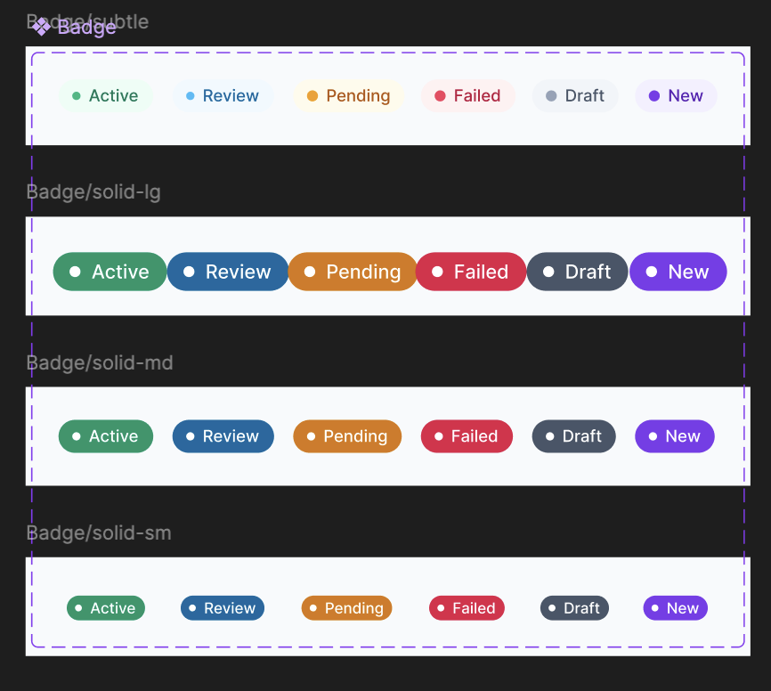
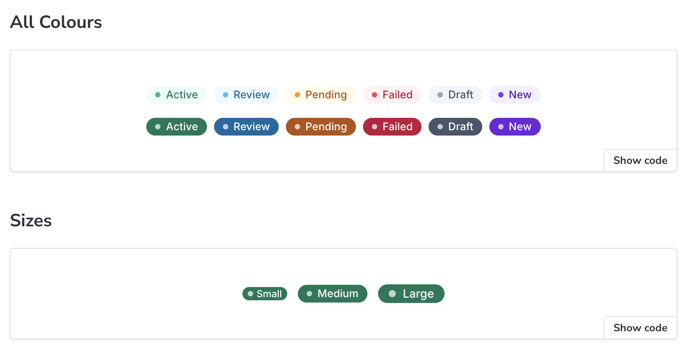
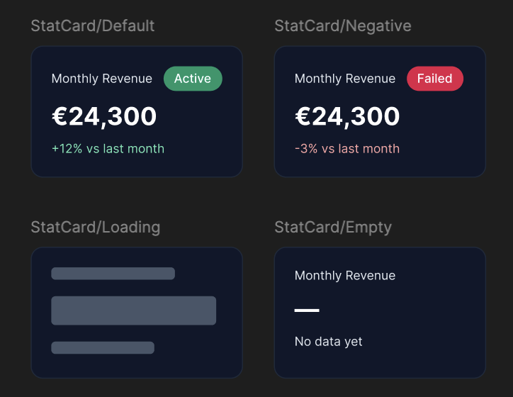
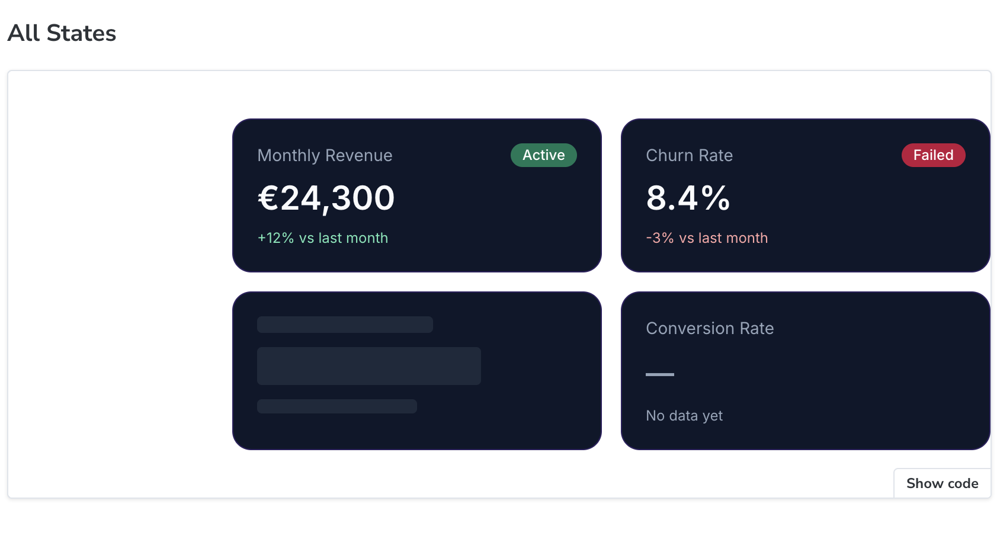
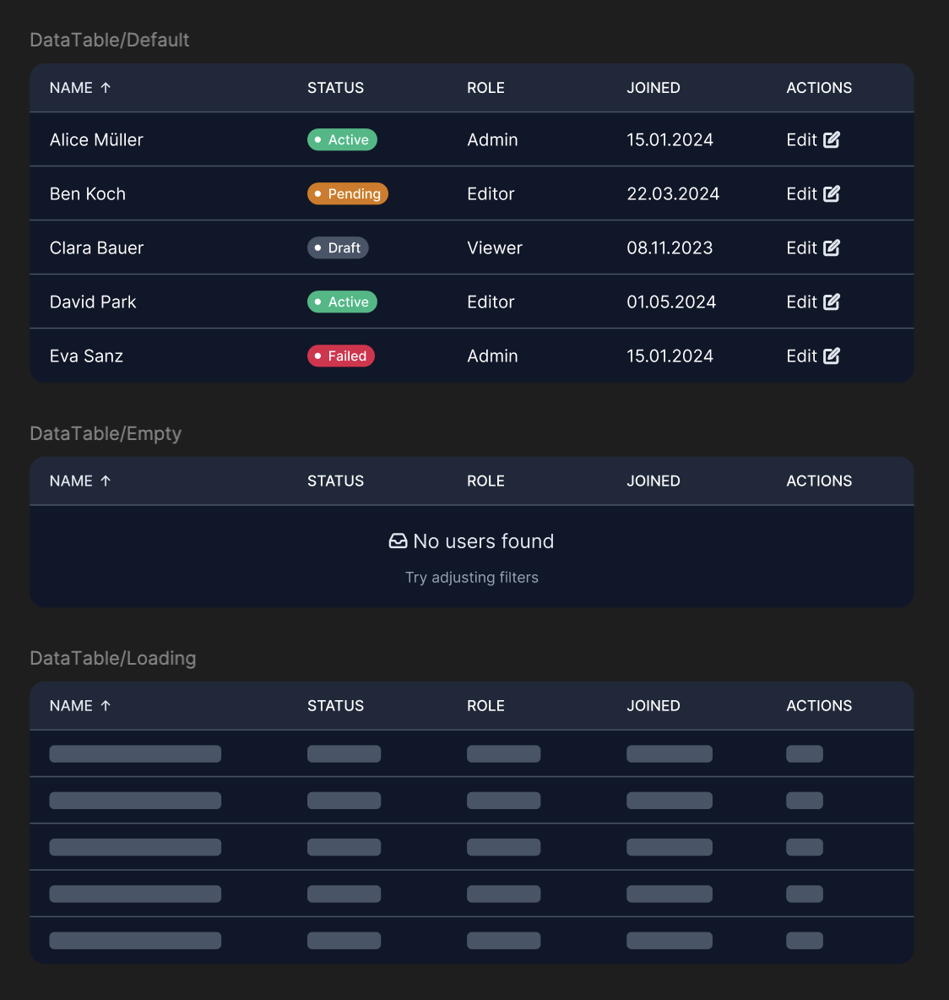
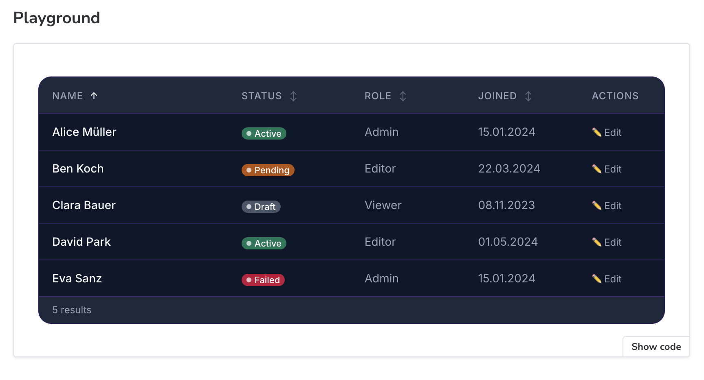

# saas-ui

> Accessible SaaS dashboard components — React · TypeScript · Tailwind CSS

[](https://www.w3.org/WAI/WCAG2AA-Conformance)
[](https://opensource.org/licenses/MIT)
[]()

A focused, opinionated component library built for SaaS product teams. Every component is designed accessibility-first with WCAG AA compliance verified in Storybook, and ships with three built-in themes.

---

## Live Storybook

> 🔗 [Vercel](https://saas-fu6y8zyag-alekoles-projects.vercel.app/)

## Figma Design System

> 🎨 [View in Figma](https://www.figma.com/design/So0CS02VQjOtc3tEmZrOnt/saas-ui-%E2%80%94-Design-System?node-id=1-2&t=jTd6PEWvxpROwmAe-1) — colour variables, component designs, and side-by-side design/code comparisons for every component.

---

## Themes

Three complete themes, each with its own personality and full semantic colour palette. Switch live in Storybook.

| Theme | Style | Primary |
|---|---|---|
| 🟣 Violet | Light page · dark cards | `#7c3aed` |
| 🟡 Amber | Full dark | `#d97706` |
| 🟢 Teal | Full light | `#0d9488` |
```ts
// Use only what you need
import "@yourname/ui/themes/violet.css"
import "@yourname/ui/themes/amber.css"
import "@yourname/ui/themes/teal.css"
```

---

## Components

| Component | Status | a11y |
|---|---|---|
| Badge | ✅ Done | WCAG AA |
| StatCard | ✅ Done | WCAG AA |
| DataTable | ✅ Done | WCAG AA |
| Modal | ⬜ Planned | — |
| Toast | ⬜ Planned | — |
| Skeleton | ⬜ Planned | — |
| Empty State | ⬜ Planned | — |
| Filter / Search | ⬜ Planned | — |
| Command Menu | ⬜ Planned | — |

---

## Design → Code

Every component is designed in Figma first, then matched pixel-perfectly in Storybook.

### Badge

| Figma design | Storybook implementation |
|---|---|
|  |  |

### StatCard

| Figma design | Storybook implementation |
|---|---|
|  |  |

### DataTable

| Figma design | Storybook implementation |
|---|---|
|  |  |

---

## Quick start
```bash
npm install @yourname/ui
```
```tsx
import "@yourname/ui/themes/violet.css"
import { Badge } from "@yourname/ui"

<Badge label="Active" color="success" variant="subtle" dot />
```

---

## Design system

Components are built on a token architecture — every colour, spacing value, and radius references a CSS custom property. Swap the theme file, everything re-themes automatically.
```
src/
├── themes/
│   ├── violet.css    — Violet theme tokens
│   ├── amber.css     — Amber theme tokens
│   └── teal.css      — Teal theme tokens
├── tokens/
│   └── index.ts      — Neutral scale, spacing, radius, typography
└── components/
    ├── Badge/
    ├── StatCard/
    └── DataTable/
```

---

## Development
```bash
npm install
npm run storybook     # Component workshop at localhost:6006
npm run build         # Bundle for publishing
```

---

## License

MIT — free to use in personal and commercial projects.